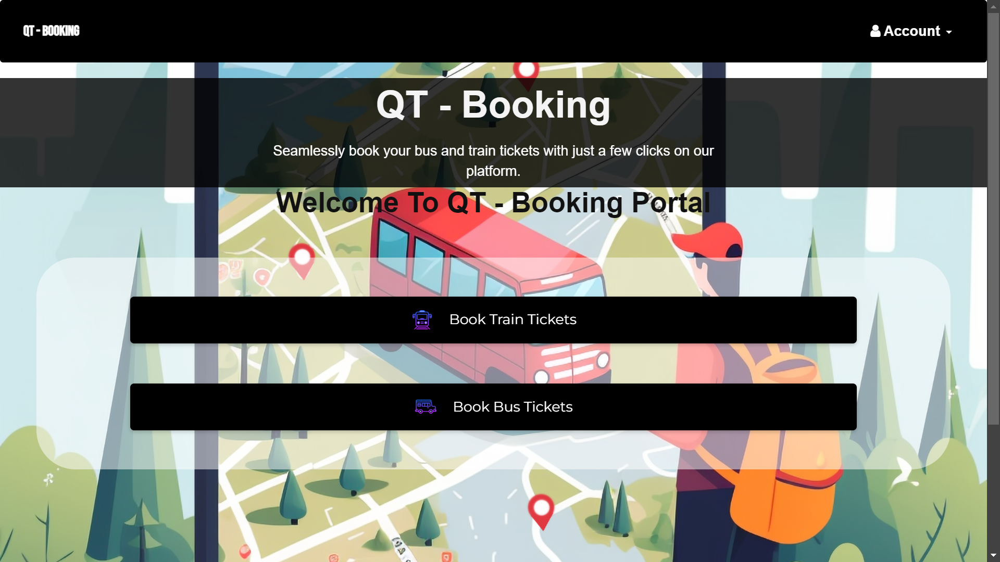
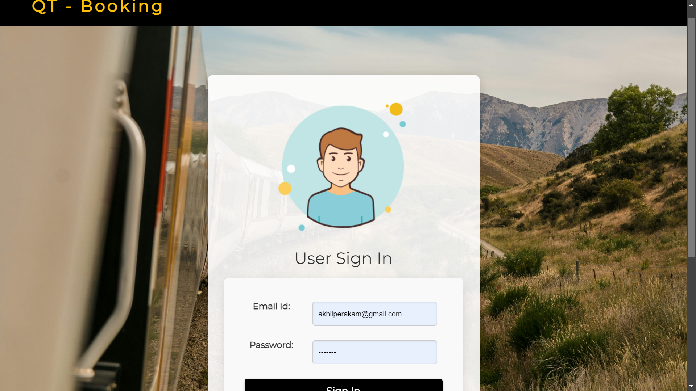
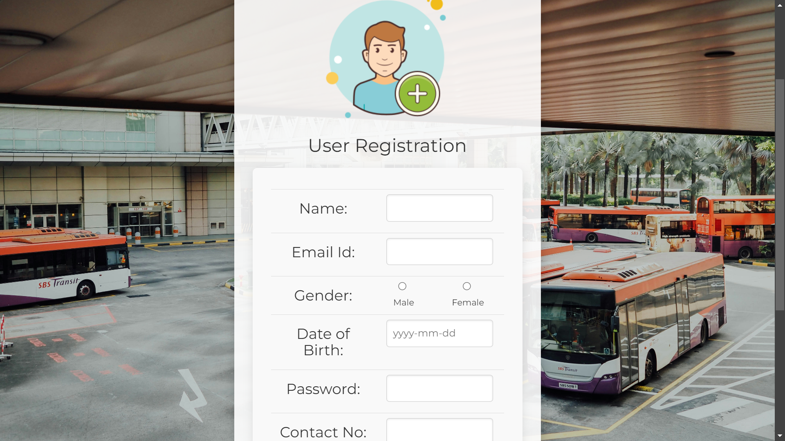
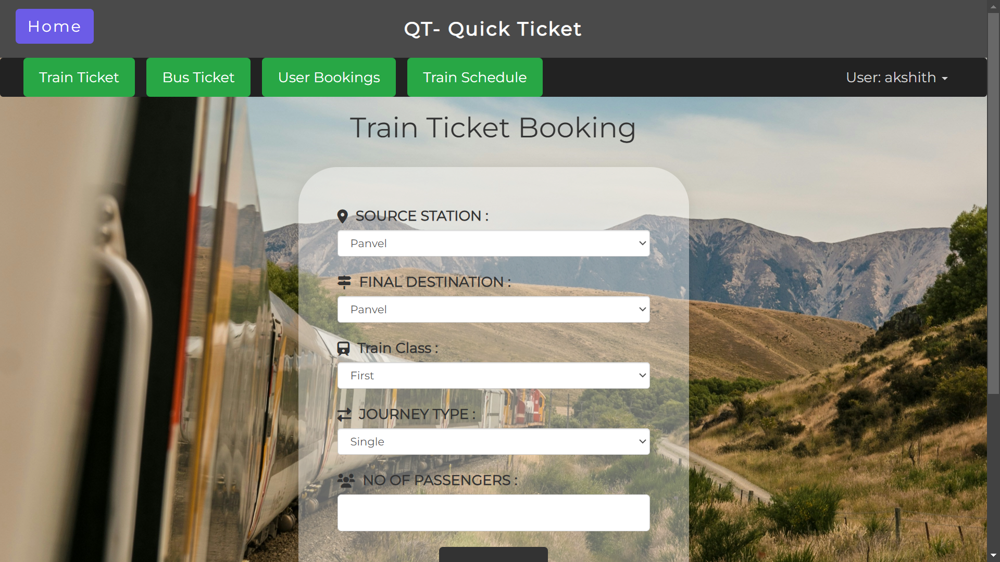
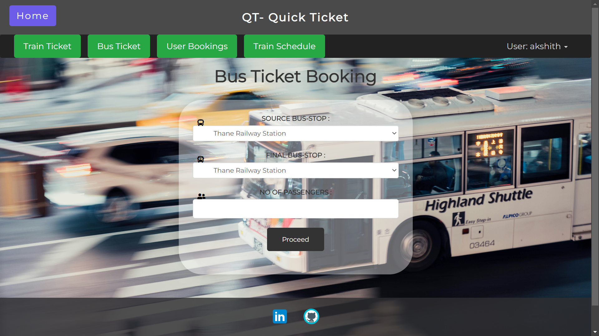
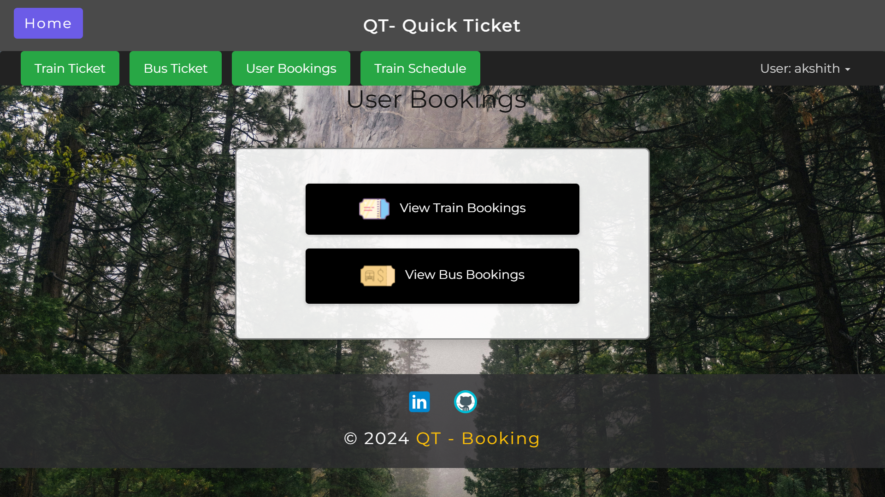

# QT-Ticket Booking System

* The QT-Ticket Booking System is designed to provide an online platform for citizens to seamlessly book tickets for both trains and buses. Key features of the system include:
* Multi-Transport Booking: Supports ticket booking for both train and bus services.
* State-Wide Accessibility: The system is usable by citizens across any state in the country.
* Cloud Integration: All booking data is stored and maintained on a secure AWS server, ensuring reliability, scalability, and easy access.
* User-Friendly Interface: The platform offers an intuitive interface that allows users to make bookings effortlessly.
## TECH/FRAMEWORK USED:
* HTML
* CSS
* Javascript
* PHP
* Xampp Server
* MySQL
## This are some Outputs of the Project:

